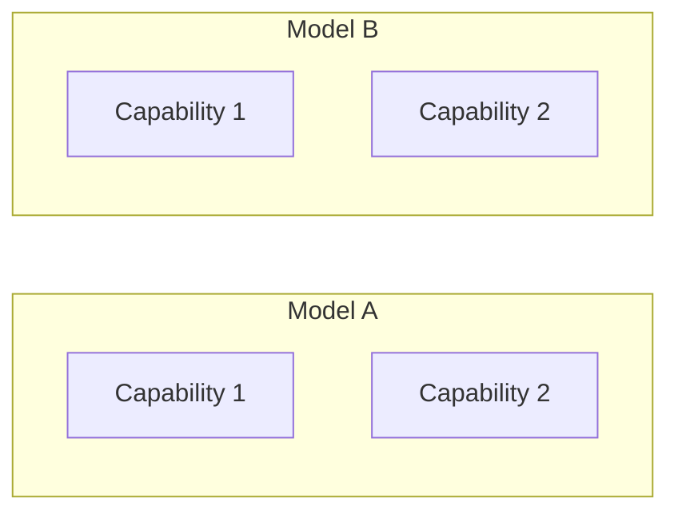
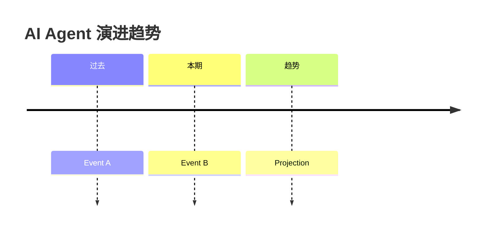

# AI Report Generator

Generate an article-style report on recent AI developments, written in Chinese (with English technical terms where they improve clarity), targeting an internal technical team audience.

## Workflow

### Step 1: Determine Time Range

**Auto-detect from existing reports (via Obsidian CLI):**

1. Use Obsidian CLI to search for existing reports: `obsidian search query="ai-report-" path="{report_dir}"`. Also search for legacy files: `obsidian search query="biweekly-" path="{report_dir}"`.
2. Sort matches by filename to find the latest one. Extract the end date from the filename (format: `ai-report-{start}--{end}.md`, e.g. `ai-report-2026-04-01--2026-04-14.md`; or legacy format `biweekly-YYYY-MM-DD.md`).
3. The **start date** is the day AFTER that latest report's date (i.e., `latest_date + 1 day`).
4. The **end date** is yesterday (today minus 1 day).
5. If no existing reports are found, fall back to: end date = yesterday, start date = end date minus 13 days (14-day window).
6. If the user explicitly specifies a time range, use that instead of auto-detection.
7. If start date >= end date (i.e., the latest report already covers up to yesterday or later), inform the user that no new period needs to be covered and stop.

Record the start and end dates — use them in all searches.

### Step 2: Multi-Source Research

Use `WebFetch` to gather information from the sources below. Fetch each source independently — parallelize where possible. If a source fails, skip it and note the gap in the report.

**Critical rule: every factual claim in the final report MUST include a clickable URL** so readers can verify and dive deeper themselves. If you cannot provide a real link for something, either find one or omit the claim.

#### Source Diversity Principle

Do NOT over-rely on any single platform. The report should synthesize information from at least 4 different source categories. Aim for a balanced mix of: papers, code, social/community voices, long-form content (podcasts/blogs), and industry news.

#### Source Category 1: Papers & Models (pick 2-3)

| URL | What it gives you |
|-----|-------------------|
| `https://huggingface.co/papers` | Daily trending AI papers with arXiv links, upvote counts |
| `https://huggingface.co/models?sort=trending` | Trending models — new releases and fast-growing projects |
| `https://huggingface.co/blog` | Framework updates, tool releases, ecosystem news |
| `https://arxiv.org/list/cs.AI/recent` | Latest AI papers |
| `https://arxiv.org/list/cs.CL/recent` | Latest NLP/LLM papers |
| `https://paperswithcode.com/greatest` | Papers gaining the most traction, with code links |

#### Source Category 2: YouTube — Podcasts & Talks

YouTube is a critical source for influencer opinions and technical deep-dives. Use these strategies:

**YouTube RSS feeds** (most reliable for WebFetch — returns XML with recent video titles, dates, and links):

| Channel | RSS URL |
|---------|---------|
| Andrej Karpathy | `https://www.youtube.com/feeds/videos.xml?channel_id=UCXUPKJO5MZQN11PqgIvyuvQ` |
| Lex Fridman | `https://www.youtube.com/feeds/videos.xml?channel_id=UCSHZKyawb7yssEoB6t7LGwQ` |
| Dwarkesh Patel | `https://www.youtube.com/feeds/videos.xml?channel_id=UC8-zcHSMq0S4rJ1HxhWSIEQ` |
| Yannic Kilcher | `https://www.youtube.com/feeds/videos.xml?channel_id=UCZHmQk67mSJgfCCTn7xBfew` |
| AI Explained | `https://www.youtube.com/feeds/videos.xml?channel_id=UCNJ1Ymd5yFuUPtn21xtRbbw` |
| Two Minute Papers | `https://www.youtube.com/feeds/videos.xml?channel_id=UCbfYPyITQ-7l4upoX8nvctg` |
| Matthew Berman | `https://www.youtube.com/feeds/videos.xml?channel_id=UCwXdFgeE9KYzlDdR7TG9cMw` |
| IndyDevDan | `https://www.youtube.com/feeds/videos.xml?channel_id=UCwFmAoP97JCEaI8h3BKfbGg` |
| Riley Brown | `https://www.youtube.com/feeds/videos.xml?channel_id=UCXa2CnmHGKIN_CRRz0s_dbQ` |

These RSS feeds return XML — parse the `<entry>` elements for `<title>`, `<published>`, and `<link>` within the date range. Each video link is `https://www.youtube.com/watch?v={video_id}`.

**Fallback**: If RSS fails, try the channel page directly: `https://www.youtube.com/@AndrejKarpathy/videos`

**Podcast RSS feeds** (for non-YouTube podcasts):

| Podcast | RSS URL |
|---------|---------|
| Latent Space | `https://www.latent.space/feed` |

#### Source Category 3: X (Twitter) — Builder & Influencer Voices

X/Twitter is where many AI builders share breaking thoughts. Use these strategies:

**Nitter instances** (public Twitter proxies that work with WebFetch):
- `https://nitter.net/{username}` — try this first
- `https://nitter.privacydev.net/{username}` — fallback

**Key accounts to check**:

| Person | Nitter URL | Why |
|--------|-----------|-----|
| Andrej Karpathy | `https://nitter.net/karpathy` | Software 3.0, context engineering, AI education |
| Jim Fan | `https://nitter.net/DrJimFan` | Foundation agents, embodied AI |
| Swyx | `https://nitter.net/swyx` | AI engineering, Latent Space pod |
| Simon Willison | `https://nitter.net/simonw` | AI tooling, LLM application patterns |
| Lilian Weng | `https://nitter.net/lilianweng` | OpenAI, agent survey author |
| Harrison Chase | `https://nitter.net/hwchase17` | LangChain/LangGraph creator |
| Logan Kilpatrick | `https://nitter.net/OfficialLoganK` | Google AI DevRel |
| Boris (xpilot) | `https://nitter.net/nicepilot` | Claude Code builder, skill creator, practical agent patterns |
| IndyDevDan | `https://nitter.net/IndyDevDan` | Claude Code power user, AI dev workflows |
| Riley Brown | `https://nitter.net/raboratory` | AI agent demos, browser use, practical builds |
| McKay Wrigley | `https://nitter.net/mcaboratory` | AI coding tools, cursor/claude workflows |
| Thorsten Ball | `https://nitter.net/thorstenball` | Zed editor, AI-assisted development |

**Fallback**: If Nitter is down, try `https://xcancel.com/{username}` or search for the person's recent blog posts instead.

#### Source Category 4: Medium & Substack — Long-Form Technical Writing

| URL | What it gives you |
|-----|-------------------|
| `https://medium.com/tag/artificial-intelligence/recommended` | Top AI articles on Medium |
| `https://medium.com/tag/llm/recommended` | LLM-specific articles |
| `https://medium.com/tag/ai-agents/recommended` | Agent-specific articles |
| `https://towardsdatascience.com/latest` | Data science / ML technical posts |
| `https://pub.towardsai.net/latest` | AI-focused technical articles |
| `https://simonwillison.net/` | Simon Willison's blog — LLM tools & patterns |
| `https://lilianweng.github.io/` | Lilian Weng's blog — deep AI surveys |
| `https://www.interconnects.ai/` | Nathan Lambert's Interconnects — RLHF, alignment |

#### Source Category 5: GitHub — New & Fast-Growing AI Repos

**Primary Discovery Source: Star History Weekly Leaderboard**

`https://star-history.com/` — Check the **Weekly** tab for repos with highest star growth this week.

This leaderboard is gold for AI reports because:
- Shows actual star *velocity*, not just total stars
- Naturally skews toward AI repos (that's where growth is happening)
- Updates weekly with exact star delta numbers
- No keyword filtering needed — the market does the filtering

Use WebFetch on the star-history homepage and look for the Weekly ranking. Each entry shows: repo name, weekly star gain (e.g., "+7.3k"), and rank.

**Secondary Discovery: GitHub CLI** (for AI-specific keyword search)

```bash
# Search for AI repos created in the last month, sorted by stars
gh search repos "AI agent" --created=">={start_date}" --sort=stars --limit=20
gh search repos "LLM framework" --created=">={start_date}" --sort=stars --limit=20
gh search repos "context engineering" --created=">={start_date}" --sort=stars --limit=10
gh search repos "claude code skill" --created=">={start_date}" --sort=stars --limit=10
gh search repos "MCP server" --created=">={start_date}" --sort=stars --limit=10
gh search repos "agent harness" --created=">={start_date}" --sort=stars --limit=10
gh search repos "code graph" --created=">={start_date}" --sort=stars --limit=10

# Get details on a specific repo (star count, creation date, description)
gh repo view owner/repo --json stargazerCount,createdAt,description,url
```

Why use `gh search` instead of `github.com/trending`? GitHub trending shows ALL repos — we need AI-specific keywords to filter for relevant projects.

**Step 2: Verify Growth** — Use star-history.com to confirm star velocity:

For each candidate repo from Step 1, generate a star-history chart:
- Single repo: `https://star-history.com/#owner/repo&Date`
- Compare repos: `https://star-history.com/#repo1&repo2&repo3&Date`
- Example: `https://star-history.com/#anthropics/claude-code&modelcontextprotocol/servers&Date`

Before featuring a repo in the report:
1. Check its star-history chart for actual growth pattern (not just total stars)
2. Look for recent acceleration (hockey stick) vs. flat/declining trends
3. Include the star-history URL in the report so readers can explore

**Fallback discovery** (if gh CLI fails):
- `https://github.com/trending?since=weekly` — then manually filter for AI-related repos
- `https://github.com/trending/python?since=weekly`
- `https://github.com/trending/typescript?since=weekly`

#### Source Category 6: Industry News & Community

| URL | What it gives you |
|-----|-------------------|
| `https://news.ycombinator.com/` | Hacker News front page |
| `https://www.reddit.com/r/MachineLearning/top/?t=week` | Top ML posts this week |
| `https://www.reddit.com/r/LocalLLaMA/top/?t=week` | Local LLM community highlights |
| `https://www.theverge.com/ai-artificial-intelligence` | Major AI news |
| `https://techcrunch.com/category/artificial-intelligence/` | AI startup/funding news |
| `https://www.jiqizhixin.com/` | 机器之心 — Chinese AI media |
| `https://www.anthropic.com/news` | Anthropic announcements |
| `https://openai.com/blog` | OpenAI announcements |
| `https://blog.google/technology/ai/` | Google AI blog |
| `https://ai.meta.com/blog/` | Meta AI blog |

#### Source Category 7: Developer Tools, Skills & MCP Ecosystem

This category tracks the practical tools that help developers work with AI day-to-day — Claude Code skills, MCP servers, CLI tools, VS Code extensions, agent harnesses, and workflow automations.

| URL | What it gives you |
|-----|-------------------|
| `https://github.com/anthropics/claude-code/discussions` | Claude Code community — new skills, workflows, tips |
| `https://github.com/punkpeye/awesome-mcp-servers` | Curated MCP server directory |
| `https://github.com/topics/claude-code-skill` | GitHub topic for Claude Code skills |
| `https://github.com/topics/mcp-server` | GitHub topic for MCP servers |
| `https://openai.com/index/` | OpenAI announcements — agent harness, Codex, etc. |

**GitHub CLI queries for dev tools**:
```bash
gh search repos "MCP server" --sort=stars --limit=20 --created=">={start_date}"
gh search repos "claude code" --sort=stars --limit=10 --created=">={start_date}"
gh search repos "AI CLI" --sort=stars --limit=10 --created=">={start_date}"
```

#### Fetching Strategy

1. **Parallelize aggressively**: Launch WebFetch calls to multiple source categories simultaneously.
2. **Try Bash fallbacks**: If WebFetch fails for YouTube/X/GitHub, try `curl` or `gh` via Bash.
3. **Minimum diversity rule**: The final report MUST contain information from at least 4 different source categories. If you only got HuggingFace data, explicitly note the limitation and try harder with Bash-based fetches.
4. **Track source balance**: At the end of research, count how many items came from each category. If >60% comes from a single source, go back and fetch more from underrepresented categories.

#### Recommended Search Queries

```
"AI agent framework" OR "agent engineering" OR "context engineering"
"LLM release" OR "foundation model"
"AI coding assistant" OR "AI developer tools"
"agent harness" OR "agent orchestration" OR "agent scaffold"
"claude code skill" OR "MCP server" OR "AI CLI tool"
site:arxiv.org agent OR "large language model"
Karpathy OR "Dario Amodei" OR "Richard Sutton" AI
```

#### User-Supplied Material

If the user provides links, notes, or topics they want highlighted, prioritize those in the report.

### Step 3: Triage and Prioritize

Classify collected items by impact:

- **Major** (must cover): new flagship models, major framework releases, paradigm-shifting papers, landmark industry moves, new agent harness patterns, breakthrough dev tools
- **Notable** (should cover): strong papers, fast-growing OSS projects, influential builder opinions, useful new skills/MCP servers, agent orchestration pattern shifts
- **Brief mention** (one-liner): minor updates, community buzz
- **Engineering priority**: When triaging, weight items by "can a dev act on this?" — a new MCP server they can install today beats a theoretical paper every time

### Step 4: Write the Report

Follow the template below. Writing guidelines:

- **Language**: Chinese body text. Keep English for proper nouns, technical terms, repo names, paper titles — wherever it aids precision.
- **Tone**: Analytical and opinionated, written for engineers who want depth. For each item, cover *what it is → how it works (technical detail) → why it matters → what it means for practitioners*. Don't just name-drop — explain the mechanism, the architecture choice, the benchmark delta. A reader should walk away understanding the *substance*, not just the headline.
- **Depth**: Each major item (model release, paper, framework) deserves 2-4 paragraphs of real analysis. Include architecture details, benchmark numbers, key design decisions, and comparison with prior work. Think "technical blog post" depth, not "news ticker" brevity.
- **Links**: Every item MUST include at least one clickable URL (paper link, GitHub repo URL, blog post, YouTube video). This is non-negotiable — readers need to click through and explore on their own.
- **Visuals**: Use Mermaid diagrams for architecture comparisons, capability maps, and trend timelines. Use ASCII diagrams for quick inline illustrations (layer stacks, simple flows).
- **Length**: Minimum 5000 Chinese characters (excluding diagram code). Aim for 5000–8000. Depth over breadth — it's better to cover fewer items with real analysis than many items as one-liners.

## Report Template

````markdown
# AI 报告：{start_date} – {end_date}

> 本报告覆盖 {start_date} 至 {end_date} 期间 AI 领域重要进展，面向技术团队内部阅读。

## 本期速览

<!-- 3-5 sentence executive summary highlighting the 2-3 biggest stories -->

---

## 一、大模型发布与技术报告

<!-- For each release, write 2-4 paragraphs covering:
     - Model name, org, release date, link to announcement/paper
     - Architecture details (parameter count, MoE config, context length, training data)
     - Key benchmark numbers with specific scores, compared to predecessor and competitors
     - Technical innovations (what's new in the architecture or training approach)
     - Practical implications for developers (API availability, cost, deployment options)
     If multiple releases, add a Mermaid chart comparing capabilities -->



## 二、Agent 工程与框架进展

<!-- For each framework/update, write 2-3 paragraphs covering:
     - What changed: version number, new capabilities, breaking changes
     - Architecture analysis: design philosophy, how it compares to alternatives
     - Code-level insight: key abstractions, API patterns, integration points
     - Link to repo, changelog, or announcement
     Use an architecture diagram to illustrate key designs -->

```
┌─────────────────────────────────┐
│         Agent Orchestrator       │
├────────┬────────┬───────────────┤
│ Planner│ Memory │ Tool Registry │
└────────┴────────┴───────────────┘
```

## 三、Agent Harness 与编排模式

<!-- "Agent harness" is the emerging term (coined by OpenAI) for the scaffolding
     that wraps an LLM to make it an agent — the loop, tool dispatch, memory,
     guardrails, and orchestration logic. This section tracks new patterns and
     tools in this space.

     Cover any of these that appeared in the period:
     - New agent harness frameworks or major updates (e.g., OpenAI Agents SDK, Claude Agent SDK, smolagents)
     - Orchestration patterns: multi-agent, handoff, hierarchical, swarm
     - Guardrails & safety wrappers for agents
     - Agent-computer interfaces: computer use, browser use, shell access patterns
     - Agent evaluation & benchmarking tools (SWE-bench, TAU-bench, etc.)

     For each, explain: what pattern it implements, how it differs from alternatives,
     and what a dev should take away for their own agent builds. -->

## 四、开发者工具箱：Skills, MCP & CLI

<!-- This section is specifically for the dev who wants to STAY PRODUCTIVE in the
     AI era. Focus on practical, immediately usable tools:

     - Claude Code skills: new community skills, useful patterns, skill design tips
     - MCP servers: new servers that unlock capabilities (database, browser, API integrations)
     - CLI tools: AI-powered CLI tools, shell integrations, workflow automations
     - IDE integrations: VS Code extensions, Cursor features, Zed AI, Windsurf updates
     - Dev workflow patterns: how builders are combining these tools in practice

     For each tool, include: what it does, install/setup command if simple, and
     a concrete "you can use this to..." example. Think "awesome list with context."
     Link to repo/install page. -->

## 五、GitHub 新兴 AI 项目

<!-- IMPORTANT: This section is about NEWLY EMERGED repos — projects that are young
     (created in the last few months) and gaining stars fast. NOT established repos
     like langchain or transformers. Look for:
     - Repos created recently with rapid star acceleration
     - New agent frameworks, coding tools, inference engines that just appeared
     - Forks/derivatives that signal a new trend

     For each project, include:
     - Full GitHub URL (clickable)
     - Creation date or first release date if visible
     - Current star count and recent growth velocity
     - 1-2 paragraph description: what it does, why it's growing, what niche it fills
-->

| 排名 | 项目 | 周增星 | 总星数 | 亮点 |
|------|------|--------|--------|------|
| 1 | [owner/repo](https://github.com/owner/repo) | +7.3k | 12k | One-line description |

<!-- Use star-history.com Weekly leaderboard as the primary source for this table.
     The leaderboard naturally surfaces AI repos because that's where growth is.

     After the table, pick the top 2-3 most interesting repos and write a deeper
     analysis paragraph for each: what problem it solves, how it works, why the
     growth trajectory matters.

     Include star-history.com links for comparison charts:
     https://star-history.com/#repo1&repo2&repo3&Date -->

## 六、重要论文

<!-- Per paper, write 2-3 paragraphs covering:
     - Full title, authors, institution, arXiv link (clickable)
     - Problem statement: what gap does this fill?
     - Method: how does it work at a technical level (architecture, training approach, key innovation)
     - Results: specific benchmark numbers, comparison with baselines
     - Practical takeaway: what should practitioners learn from this?
     Focus areas: AI Agent, Context Engineering, Prompt Engineering, multi-modal
     Tier the papers: Tier 1 (must-read) get 3 paragraphs, Tier 2 get 1-2 paragraphs -->

## 七、Builder 观点与播客

<!-- This is NOT just for famous researchers — prioritize voices of people who are
     BUILDING with AI daily. Two categories:

     **Builders & Practitioners** (prioritize these):
     - Boris (xpilot/nicepilot): Claude Code skills, practical agent patterns
     - IndyDevDan: Claude Code workflows, AI dev productivity
     - Riley Brown: agent demos, browser use builds
     - Thorsten Ball: AI-assisted development in Zed
     - McKay Wrigley: AI coding tool workflows
     - Swyx: AI engineering patterns, Latent Space insights

     **Thought Leaders & Researchers** (include when they say something actionable):
     - Karpathy: Software 3.0, context engineering
     - Dario Amodei, Richard Sutton, Ilya Sutskever, Jim Fan

     For each person/episode, write 1-2 paragraphs covering:
     - Who, where (podcast name + episode link, tweet URL, blog post URL)
     - Core thesis in their own words (quote if possible)
     - **Actionable takeaway**: what can a dev DO differently based on this insight?
     - Contrarian or notable aspect: what challenged conventional thinking?

     The tone should be "here's what the people actually shipping are saying"
     not "here's what the ivory tower thinks." -->

## 八、行业动态

<!-- Funding rounds, acquisitions, product launches, policy changes -->

## 九、趋势洞察

<!-- Distill 2-3 trend observations from this period's data -->
<!-- Use a Mermaid timeline or flowchart to show trend evolution -->



## 十、值得关注的资源

<!-- Tutorials, tools, datasets, courses released this period -->

---

*本报告由 AI 辅助生成，信息来源截止 {end_date}。如有遗漏或错误，欢迎补充。*
````

### Step 5: Save and Deliver

1. Save the report using Obsidian CLI: `obsidian create path="{report_dir}/ai-report-{start_date}--{end_date}.md" content="..." silent` (e.g. `wiki/ai-report-2026-04-01--2026-04-14.md`). The `report_dir` is defined in frontmatter (default: `wiki`). Use `silent` to avoid opening the file in Obsidian during creation.
2. Inform the user:
   - The report is ready for review at `{report_dir}/ai-report-{start_date}--{end_date}.md`.
   - The time range covered (start date – end date).
   - To upload to Feishu, use the `/feishu-doc` skill on that file.

## Quality Checklist

- **Minimum 5000 Chinese characters** (excluding diagram code). If below this, go back and add more depth to major items.
- Every section has at least one item (if genuinely nothing happened, state "本期无重大更新")
- **Every factual claim includes a clickable URL** — paper links, GitHub repo URLs, blog posts, YouTube videos. No "bare" claims without a source the reader can visit.
- At least 2 Mermaid diagrams (one trend/timeline + one technical architecture or comparison)
- GitHub section features **newly emerged** repos (not established ones like langchain/transformers), with creation dates and star growth velocity
- Major items (model releases, key papers, important frameworks) each get 2-4 paragraphs of real technical depth, not just one-liners
- No fabricated information — if WebFetch fails or data is uncertain, mark it explicitly ("来源获取失败" or "待确认")

## Important Notes

- **Never invent content.** If a source is unreachable, skip it and note the gap.
- Clearly separate factual reporting from editorial analysis. The "趋势洞察" section is the place for opinions — label them as such.
- If the user wants this on a recurring schedule, suggest using cron or a scheduler with `claude -p` CLI mode.
